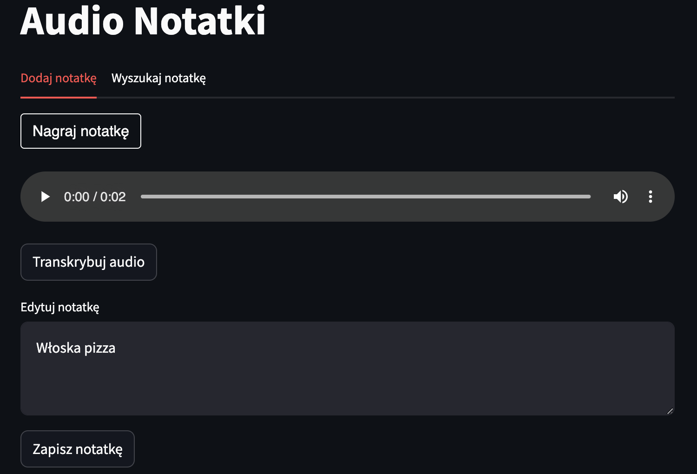
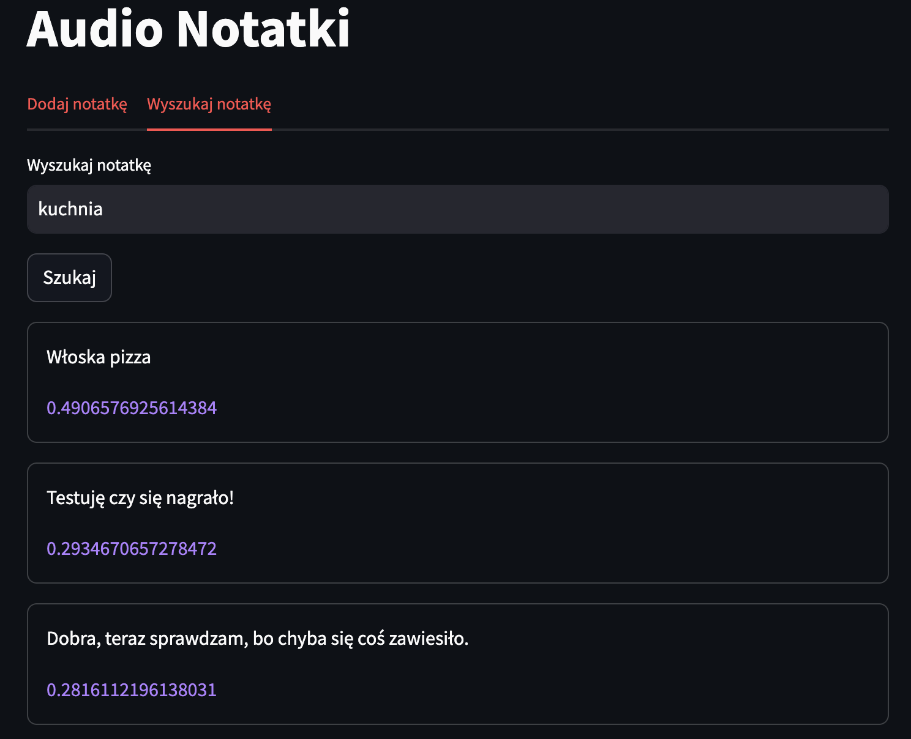

# Audio Notes App

*Date of creation: 2024-10-03*

**Project description:** 
The goal of the project was to create the first AI-powered application. To do this, I used two LLM models from OpenAI: `whisper-1` (speech -> text) and `text-embeddings-3-large` (text -> embeddings).  

**Main functionalities:** 
- recording and listening to voice notes, 
- transcription of voices into text using AI, 
- ability to collect notes in the QDrant database, 
- semantic data search, using the text processing algorithm on embeddings and finding similarities based on Cosinus Similarity. 

**Skills:** 
- Python, 
- QDrant, 
- OpenAI embeddings, 
- OpenAI whisper-1, 
- Streamlit, 
- Dotenv, 
- PyDub, 
- io, 
- md5.

**Sample photos:** 

The application has been deployed on the Streamlit Community App and **is available for public use.**

**Link to repository:** https://github.com/kasjansmigielski/audio_notes_app 
**Link do app:** https://audio-notes.streamlit.app/

[Go to application](https://audio-notes.streamlit.app/){ .md-button }