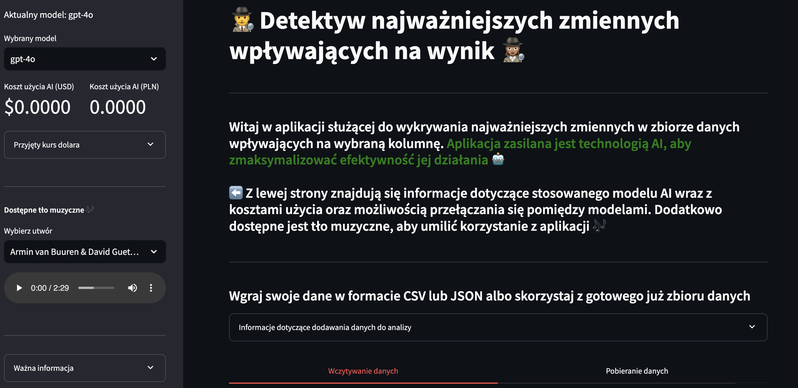
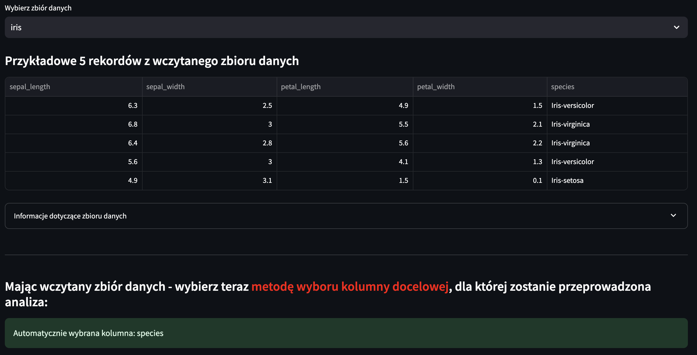
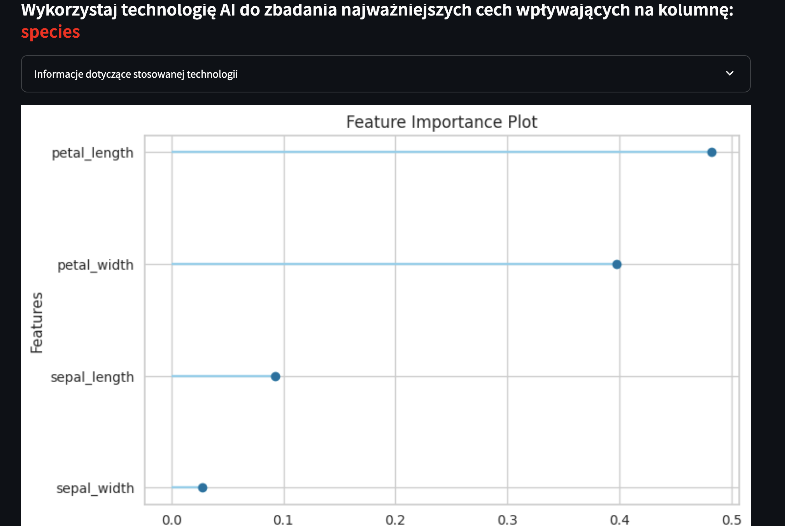
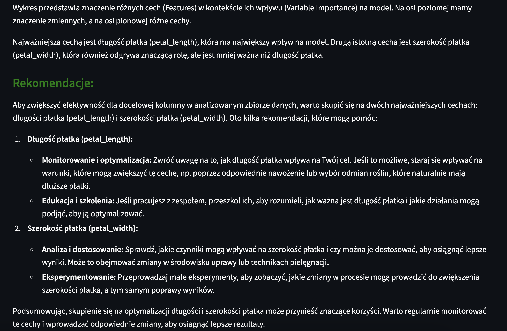

# Aplikacja: Features Detective

*2024-10-30*

#### **Opis projektu:**
Celem projektu było stworzenie uniwersalnej aplikacji pozwalającej na wykrywanie najważniejszych cech w danym zbiorze danych. W dużym skrócie - użytkownik wgrywa dane lub wczytuje gotowy zbiór danych w odpowiednim formacie, następnie wybiera automatyczną detekcję kolumny, którą chce przeanalizować bądź sam dokonuje tego wyboru. Finalnie otrzymuje wygenerowanie wykresu istotności cech, które wywierają największy wpływ na wybraną wcześniej kolumnę. Użytkownik otrzymuje również czytelny opis wykresu wraz z rekomendacjami - co można poprawić aby, np. usprawnić analizowane dane.  
**Główne funkcjonalnośći:** 
- Użytkownik może załadować plik CSV/JSON z danymi lub może skorzystać z przykładowego gotowego zbioru danych, 
- Użytkownik wskazuje kolumnę docelową -> dodatkowo ma możliwość skorzystania z automatycznej detekcji kolumny (generowanej przez LLM), 
- Aplikacja automatycznie rozpoznaje czy wczytane dane związane są z problemem regresji czy klasyfikacji i na tej podstawie dobiera odpowiedni algorytm trenowania modelu AI, 
- Na podstawie wytrenowanego modelu wyświetlany jest wykres zawierający najważniejsze cechy, 
- Finalnie użytkownik otrzymuje przejrzysty opis wykresu wraz z rekomendacjami - jakie działania wdrożyć lub poprawić aby polepszyć wyniki związane z analizowaną docelową kolumną danych.

**Do wytrenowania modelu AI** wykorzystałem narzędzia PyCaret, natomiast sam algorytm umieściłem w notebooku - gotowym do pobrania.
<a href="model_training.ipynb" class="md-button md-button--primary">Pobierz Notebook: "Trenowanie modelu"</a>

Aplikacja została wdrożona na Streamlit Community App i jest dostępna do publicznego użytku.

**Wykorzystane technologie:** 
- Python, 
- Langfuse, 
- OpenAI, 
- Streamlit, 
- PyCaret (Classification & Regression), 
- Pandas, 
- Matplotlib, 
- Instructor, 
- Pydantic, 
- Boto3.

**Link do repozytorium:** https://github.com/kasjansmigielski/feature_detective_app 
**Link do aplikacji:** https://feature-detective.streamlit.app/

[Przejdź do aplikacji](https://feature-detective.streamlit.app/){ .md-button }

