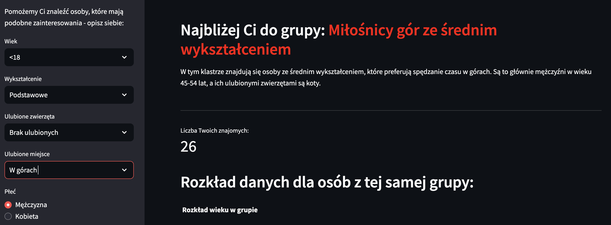
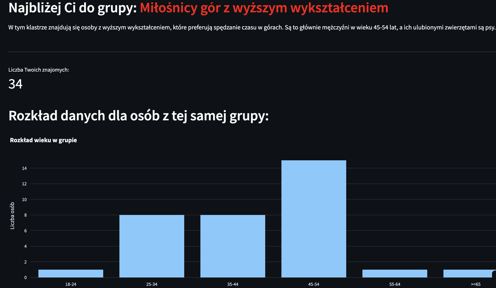

# Find Friends App

*Data of creation: 2024-10-09*

**Project description:** 
The aim of the project was to create an application that would enable the use of a clustering model to match a user to the appropriate group from a loaded data set (data comes from an anonymized survey) - based on data provided by the user. 

**Main functionalities:** 
- the user filters basic data, such as: age, education, gender, favorite animals or favorite places - corresponding to their preferences, 
- then the previously trained clustering model creates the appropriate number of clusters for the survey data and matches the user's preferences to the matching group, 
- finally, using LLM, adequate cluster descriptions are generated.

**To train the AI ​​model** I used Scikit-learn tools and I have included the implementation in a notebook ready for download: 
<a href="clustering_model_training.ipynb" class="md-button md-button--primary">Download Notebook: Model training</a>

**To generate Clusters names** I used the LLM model and I have included the implementation in a notebook ready for dowlonad: 
<a href="clusters_naming.ipynb" class="md-button md-button--primary">Download Notebook: Clusters naming</a>

**Skills:** 
- Python, 
- Langfuse, 
- OpenAI, 
- Streamlit, 
- Scikit-learn, 
- Plotly, 
- PyCaret (Clustering), 
- NumPy, 
- Matplotlib.

**Sample photos:** 

The application has been deployed on the Streamlit Community App and **is available for public use.**

**Link to repository:** https://github.com/kasjansmigielski/find_friends_app 
**Link to app:** https://find-friends-app.streamlit.app/

[Go to application](https://find-friends-app.streamlit.app/){ .md-button }