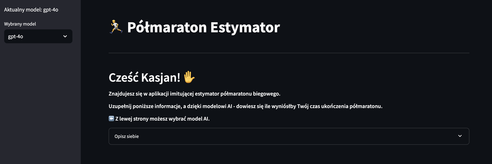
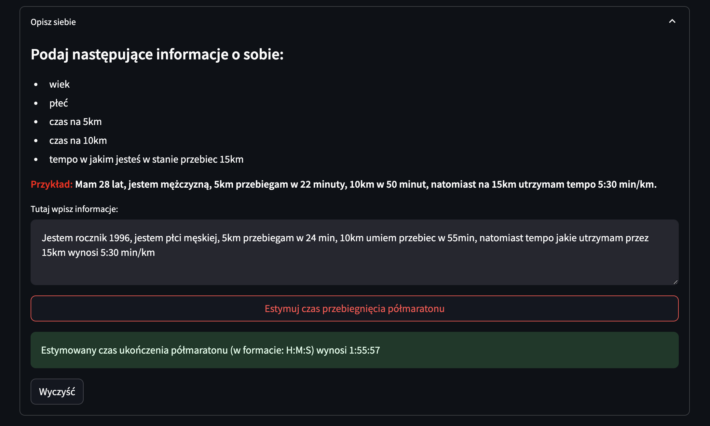

# Aplikacja: Halfmarathon Estimator

*2024-10-20*

#### **Opis projektu:**
Celem projektu było stworzenie aplikacji, która wykorzysta algorymt regresyjny przy trenowaniu modeli i będzie potrafiła przewidzieć (na podstawie wcześniej wytrenowanych danych) czas, w jakim użytkownik przebiegnie półmaraton - podając określone dane. 
**Główne funkcjonalności:** 
- umożliwienie użytkownikowi swobody podczas podawania danych (bez żadnej odpowiedniej konwercji zapisu) - wykorzystany model LLM wyciąga dane od użytkownika do struktury JSON i przygotowuje je do wykorzystania przez model regresyjny, 
- prosta funkcjonalność pozwala ostateczna wyestymować czas przebiegnięcia półmaratonu - stosując wytrenowany najlepszy model regresyjny, 
- model LLM jest podpięty pod Langfuse, aby móc śledzić cykl życia modelu.

Do wytrenowania modelu wykorzystałem automatyzację PyCaret, natomiast sam algorytm umieściłem w notebooku - gotowym do pobrania.
<a href="create_pipeline.ipynb" class="md-button md-button--primary">Pobierz Notebook</a>

Aplikacja została wdrożona na Streamlit Community App i jest dostępna do publicznego użytku.

**Wykorzystane technologie:** 
- Python, 
- PyCaret, 
- Machine Learning, 
- Langfuse, 
- OpenAI, 
- Streamlit, 
- Pandas, 
- Instructor, 
- Pydantic, 
- Langfuse, 
- Dotenv.

**Link do repozytorium:** https://github.com/kasjansmigielski/halfmarathon_estimator_app 
**Link do aplikacji:** https://halfmarathon-estimator.streamlit.app/

[Przejdź do aplikacji](https://halfmarathon-estimator.streamlit.app/){ .md-button }