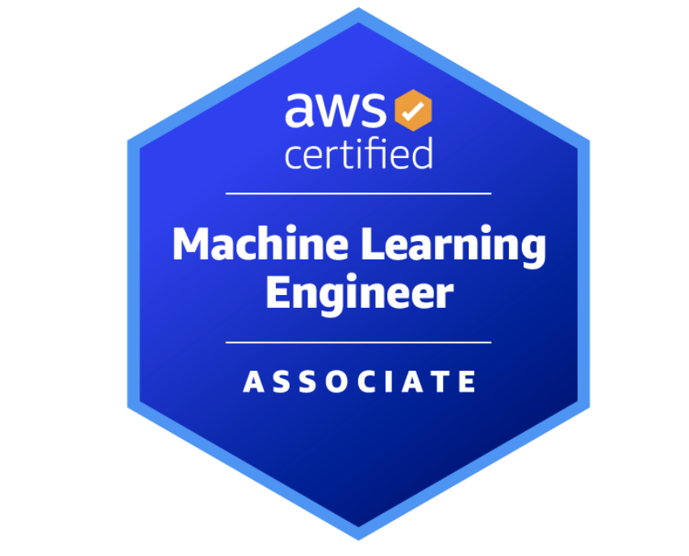

<h1>Projects from the world of data, Python programming and AI technologies</h1>

## Introduction

Welcome to my website dedicated to projects in the field of data analysis, machine learning and artificial intelligence. 

## My short story

In 2019, I graduated with a degree in Mechatronics from Wrocław University of Science and Technology, sparking my desire to explore new technologies. Over the past five years, I worked as an engineer in the manufacturing industry, where data played a crucial role in my work. By analyzing production and quality data, I was able to optimize processes and find innovative solutions to enhance productivity and efficiency.

Since the year, I have been developing a strong interest in AI, which has led me to <strong>complete a Data Scientist course and start building my portfolio</strong>. I have developed several practical projects and have more ideas that I aim to turn into commercial products.

 I have also <strong>secured my dream job in a Data Science department</strong>, where I will be working on projects related to Machine Learning and Deep Learning. Additionally I am a <strong>certified AWS Machine Learning Engineer Associate</strong>, which has strengthened my cloud-based ML implementation skills.

## My current activity

Due to my growing passion for AI and Data Science, <strong>I began my master's studies in March 2025 in Artificial Intelligence and Machine Learning.</strong> I am deeply committed to advancing my academic career. My master's thesis will focus on utilizing computer vision algorithms in a project collaborating with the Medical University of Wrocław. <strong>This project will involve detecting larvae and analyzing their behaviors under experimental conditions.</strong>

 Additionally, since January 2025, <strong>I have been a Student Success Manager at Gotoit, where I have the opportunity to mentor a Data Science course.</strong> I conduct weekly live sessions where we expand our knowledge in data and AI. I am also experimenting with creating tutorials on Python, SQL, and other libraries useful in the Data Science field.

 Recently, I have taken on the role of <strong>project leader for Knowledge Seeker</strong>, an innovative system that uses RAG (Retrieval-Augmented Generation) technology to transcribe, index, and extract information from video content. This project allows me to apply cutting-edge AI techniques in a practical business context.

## About portfolio

Here you will find many projects I have been working on recently: from domain exploration (EDA) on ready-made datasets, through creating Streamlit applications - allowing you to browse data in a simple way, and ending with AI-powered and Machine Learning-based applications - to find patterns invisible at first glance.

 I invite you to familiarize yourself with the projects and I hope that everyone will find something for themselves. <strong>I encourage you to visit here regularly - I intend to expand my portfolio with new ideas on an ongoing basis.</strong>

