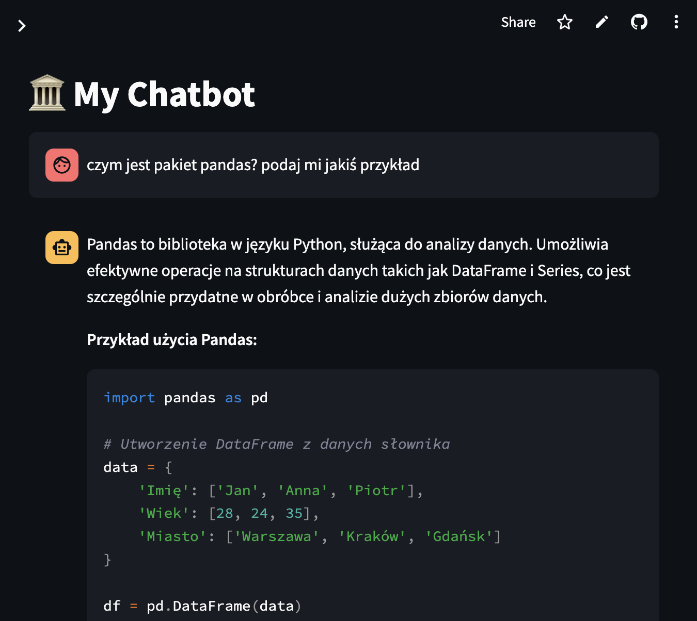
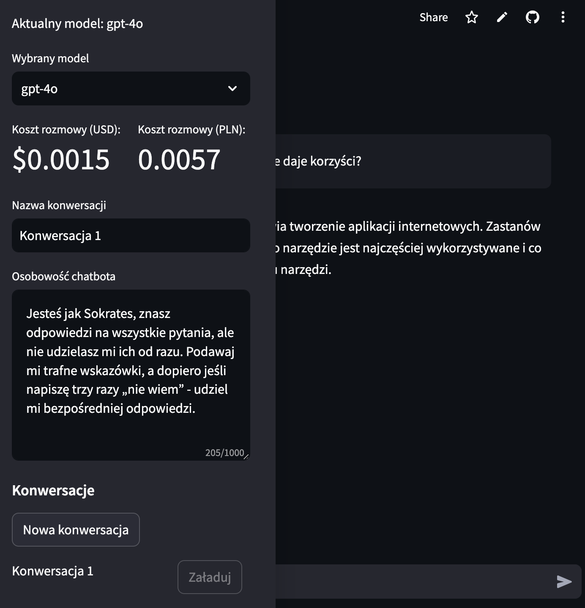

# My Chatbot App

*Date of creation: 2024-09-15*

**Project description:** 
The aim of the project was to create own version of Chat GPT, based on the Streamlit application interface. The chatbot can take on any personality to maximize its functionality to our preferences.

**Main functionalities:** 
- the chatbot remembers conversations and saves them in a JSON file structure, and you can easily switch between conversations (without losing your chat history), 
- you can choose between various models from OpenAI (*more models in the future*), 
- the costs of using AI are counted, 
- you can give the chatbot individual awareness that will guide the types of answers to the questions asked. 

**Skills:** 
- Python, 
- Langfuse, 
- OpenAI, 
- Streamlit.

**Sample photos:** 

The application has been deployed on the Streamlit Community App and **is available for public use.**

**Link to repository:** https://github.com/kasjansmigielski/my_chatbot_app 
**Link to app:** https://my-own-chatbot.streamlit.app/

[Go to application](https://my-own-chatbot.streamlit.app/){ .md-button }