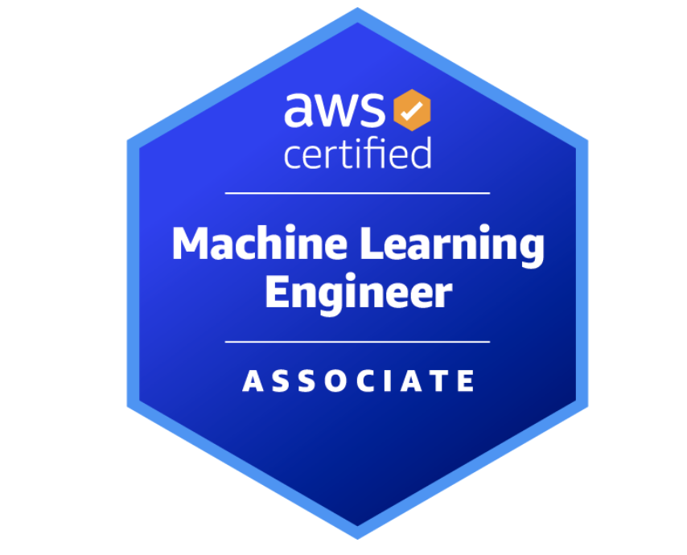

<h1>Projekty ze świata danych, programowania w Pythonie i technologii AI</h1>

## Wprowadzenie

Witaj na mojej stronie poświęconej projektom z zakresu analizy danych, uczenia maszynowego i sztucznej inteligencji.

## Moja krótka historia

W 2019 roku ukończyłem studia na kierunku Mechatronika na Politechnice Wrocławskiej, co rozbudziło moją chęć do eksplorowania nowych technologii. Przez ostatnie pięć lat pracowałem jako inżynier w przemyśle produkcyjnym, gdzie dane odgrywały kluczową rolę w mojej pracy. Analizując dane produkcyjne i jakościowe, byłem w stanie optymalizować procesy i znajdować innowacyjne rozwiązania zwiększające produktywność i efektywność.

Od pewnego czasu rozwijam silne zainteresowanie AI, co doprowadziło mnie do <strong>ukończenia kursu Data Scientist i rozpoczęcia budowania swojego portfolio</strong>. Stworzyłem kilka praktycznych projektów i mam więcej pomysłów, które zamierzam przekształcić w produkty komercyjne.

 Udało mi się również <strong>zdobyć wymarzoną pracę w dziale Data Science</strong>, gdzie pracuję nad projektami związanymi z Machine Learning i Deep Learning. Dodatkowo jestem <strong>certyfikowanym AWS Machine Learning Engineer Associate</strong>, co wzmocniło moje umiejętności implementacji ML w chmurze.

## Moja aktualna aktywność

Ze względu na rosnącą pasję do AI i Data Science, <strong>w marcu 2025 roku rozpocząłem studia magisterskie na kierunku Sztuczna Inteligencja i Uczenie Maszynowe.</strong> Jestem głęboko zaangażowany w rozwój mojej kariery akademickiej. Moja praca magisterska będzie skupiona na wykorzystaniu algorytmów computer vision w projekcie we współpracy z Uniwersytetem Medycznym we Wrocławiu. <strong>Projekt będzie polegał na wykrywaniu larw i analizowaniu ich zachowań w warunkach eksperymentalnych.</strong>

 Dodatkowo, od stycznia 2025 roku <strong>jestem Student Success Managerem w Gotoit, gdzie mam okazję mentorować kurs Data Science.</strong> Prowadzę cotygodniowe sesje live, podczas których poszerzamy wiedzę z zakresu danych i AI. Eksperymentuję również z tworzeniem tutoriali z Pythona, SQL i innych bibliotek przydatnych w Data Science.

 Ostatnio objąłem rolę <strong>lidera projektu Knowledge Seeker</strong>, innowacyjnego systemu wykorzystującego technologię RAG (Retrieval-Augmented Generation) do transkrypcji, indeksowania i wydobywania informacji z treści wideo. Ten projekt pozwala mi stosować najnowocześniejsze techniki AI w praktycznym kontekście biznesowym.

## O portfolio

Znajdziesz tutaj wiele projektów, nad którymi pracowałem ostatnio: od eksploracji danych (EDA) na gotowych zbiorach danych, przez tworzenie aplikacji Streamlit - pozwalających przeglądać dane w prosty sposób, aż po aplikacje oparte na AI i Machine Learning - do znajdowania wzorców niewidocznych na pierwszy rzut oka.

 Zapraszam do zapoznania się z projektami i mam nadzieję, że każdy znajdzie coś dla siebie. <strong>Zachęcam do regularnych odwiedzin - zamierzam na bieżąco rozszerzać moje portfolio o nowe pomysły.</strong>

