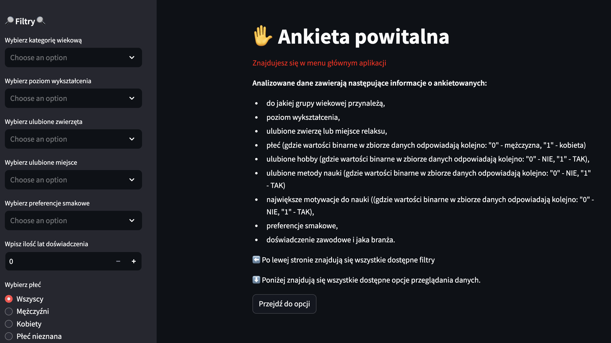
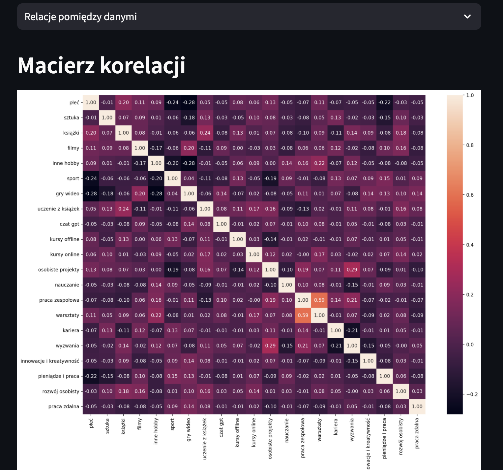
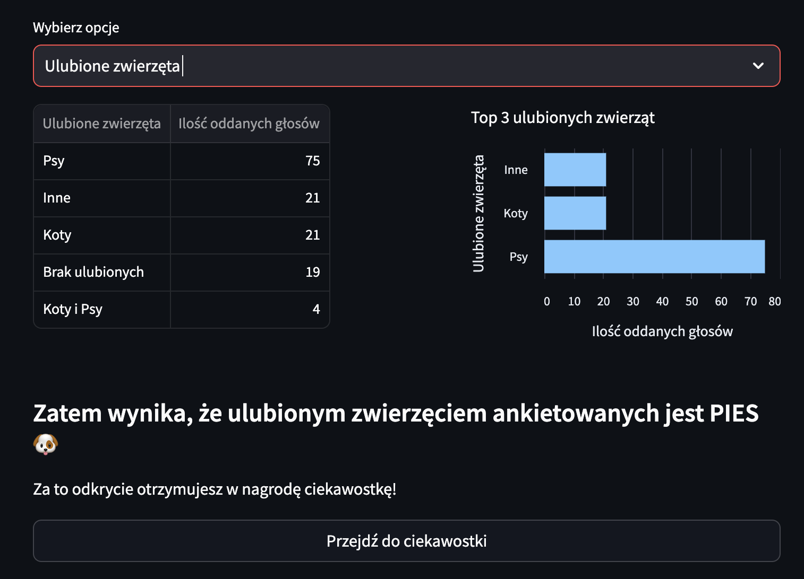

# Aplikacja: Welcome Survey

*2024-09-22*

#### **Opis projektu:**
Celem projektu było stworzenie aplikacji, która umożliwi proste filtrowanie oraz przeglądanie danych z przykładowej ankiety powitalnej (dane zostały odpowiednio zanonimizowane).    Aplikacja miała na celu utrwalenie komponentów z bilblioteki Streamlit i zaznajomienie się z odpowiednim zarządzaniem stanem aplikacji (`st.session_state`), aby wszystkie przyciski i interakcje były ze sobą responsywne.

Aplikacja została wdrożona na Streamlit Community App i jest dostępna do publicznego użytku. Zapraszam do zabawy.

**Wykorzystane technologie:** 
- Python, 
- Pandas, 
- Matplotlib, 
- Seaborn, 
- Streamlit, 
- Boto3.

**Link do repozytorium:** https://github.com/kasjansmigielski/welcome_survey_app 
**Link do aplikacji:** https://welcome-survey.streamlit.app/

[Przejdź do aplikacji](https://welcome-survey.streamlit.app/){ .md-button }